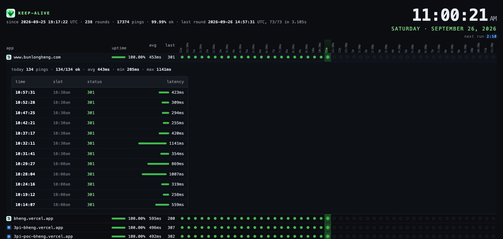

#  keep-alive

Headless HTTP pinger that keeps serverless apps warm, with an all-time uptime page.

Put your URLs in a text file and run 1 static binary. Every 5 minutes it hits all of them in parallel, logs each answer, and keeps per-URL totals across restarts. No runtime, no dependencies, about 3 seconds per round for 70 URLs on a Raspberry Pi. The optional page is served by the same binary: a live clock, today as 1 dot per 30 minutes, and every ping behind a click.


[](LICENSE)


## Features

- **Fast and parallel** - a worker pool of goroutines, 1 retry on network errors, redirects counted as alive (the function ran).
- **Never stops** - the ping loop runs on its own; the page, the TUI and the JSON files only read what it wrote.
- **All-time stats** - `stats.json` keeps pings, ok count, average ms and last failure per URL, and survives restarts.
- **3 ways to look** - browser page on `-listen`, `make tui` in a terminal over ssh, or `curl` the same address for plain text.
- **Health endpoint** - `/health` answers 503 when no round has run in 3 intervals, so a monitor can watch the watcher.
- **Add to Home Screen** - manifest and touch icon included, opens full screen on a phone.

## Quick start

```bash
git clone https://github.com/bunlongheng/keep-alive.git
cd keep-alive
# 1 URL per line, # starts a comment
$EDITOR urls.txt
make run                       # 1 round, prints a summary and any failures
./keep-alive -listen :8787     # loop forever and serve the page
```

Open http://localhost:8787. Click any row for every ping of that app today.

```
./keep-alive -h    # -urls -workers -interval -timeout -retries -log -status -stats -keep -listen -once -tui -report
```

## Raspberry Pi

```bash
sudo apt install -y git golang
git clone https://github.com/bunlongheng/keep-alive.git && cd keep-alive
make install       # builds, installs a systemd unit, starts it
```

No Go on the Pi? `make pi` on any machine cross-compiles `keep-alive-linux-arm64`, copy it over. Edit `urls.txt` any time, it is re-read every round. `make uninstall` removes the service.

## How it works

Each round appends `TS  STATUS  URL  MS` lines to `keep-alive.log` (trimmed to the newest 25,000), rewrites `status.json` with the full round and `stats.json` with the totals. A status of 0 means no answer at all. Only 0, 5xx and 404 (no deployment) count as failed; a sign-in page answering 401 is an app that woke up.

| Path | What |
|------|------|
| `/` | page in a browser, plain text for curl |
| `/health` | `ok 73/73 at <ts>`, or 503 when stale |
| `/status.json` | latest round |
| `/stats.json` | all-time totals |
| `/pings?url=` | every ping of 1 URL today |



## License

MIT
